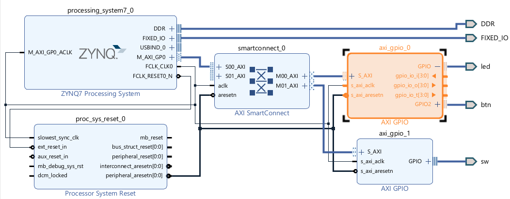

## PYNQ-Z2 Button-to-LED Project

This repository demonstrates a complete end-to-end workflow for mapping onboard buttons and switches to LEDs on the PYNQ-Z2 board. It covers:

1. **Pure Verilog Implementation**
2. **Vivado IP Integrator Block Design**
3. **Vitis Bare-Metal C Application**
4. **Debugging & Troubleshooting**

---

### Table of Contents

- [1. Verilog Implementation](#1-verilog-implementation)
- [2. Vivado Block Diagram (IP Integrator)](#2-vivado-block-diagram-ip-integrator)
- [3. Export Hardware & Generate Bitstream](#3-export-hardware--generate-bitstream)
- [4. Vitis Platform & Application](#4-vitis-platform--application)
- [5. Serial Terminal & Runtime Testing](#5-serial-terminal--runtime-testing)
- [6. Debug Section](#6-debug-section)
- [7. Images](#7-images)

---

## 1. Verilog Implementation

### 1.1. Write Top-Level Verilog (`top.v`)

```verilog
module top(
    input  wire [3:0] btn,   // BTN0–BTN3
    input  wire [1:0] sw,    // SW0–SW1
    output reg  [3:0] led    // LED0–LED3
);

always @(*) begin
    if (sw[0]) begin
        led = btn;              // direct mapping
    end else begin
        // reversed mapping
        led[3] = btn[0];
        led[2] = btn[1];
        led[1] = btn[2];
        led[0] = btn[3];
    end
end

endmodule
```

### 1.2. Constraints File (`pynq_z2.xdc`)

```xdc
# Buttons
set_property PACKAGE_PIN D19 [get_ports {btn[0]}]; set_property IOSTANDARD LVCMOS33 [get_ports {btn[0]}];
set_property PACKAGE_PIN D20 [get_ports {btn[1]}]; set_property IOSTANDARD LVCMOS33 [get_ports {btn[1]}];
set_property PACKAGE_PIN L20 [get_ports {btn[2]}]; set_property IOSTANDARD LVCMOS33 [get_ports {btn[2]}];
set_property PACKAGE_PIN L19 [get_ports {btn[3]}]; set_property IOSTANDARD LVCMOS33 [get_ports {btn[3]}];

# Switches
set_property PACKAGE_PIN M20 [get_ports {sw[0]}]; set_property IOSTANDARD LVCMOS33 [get_ports {sw[0]}];
set_property PACKAGE_PIN M19 [get_ports {sw[1]}]; set_property IOSTANDARD LVCMOS33 [get_ports {sw[1]}];

# LEDs
set_property PACKAGE_PIN R14 [get_ports {led[0]}]; set_property IOSTANDARD LVCMOS33 [get_ports {led[0]}];
set_property PACKAGE_PIN P14 [get_ports {led[1]}]; set_property IOSTANDARD LVCMOS33 [get_ports {led[1]}];
set_property PACKAGE_PIN N16 [get_ports {led[2]}]; set_property IOSTANDARD LVCMOS33 [get_ports {led[2]}];
set_property PACKAGE_PIN M14 [get_ports {led[3]}]; set_property IOSTANDARD LVCMOS33 [get_ports {led[3]}];
```

### 1.3. Build & Program

1. Run **Synthesis** → **Implementation** → **Generate Bitstream**.
2. In **Hardware Manager**, connect via JTAG and **Program Device** with the generated `.bit` file.

---

## 2. Vivado Block Diagram (IP Integrator)

### 2.1. Create Block Design
- Add **Zynq7 Processing System** and run block automation.
- Add three **AXI GPIO** IPs:
  - 4-bit for buttons
  - 2-bit for switches
  - 4-bit for LEDs

### 2.2. Wire AXI Interconnect
- Connect `M_AXI_GP0` of PS to each AXI_GPIO `S_AXI` port.

### 2.3. Expose External Ports
- Make each GPIO’s `GPIO` (and `GPIO2` for LEDs/buttons IP) external.
- Rename ports: `btn_gpio`, `sw_gpio`, `led_gpio`.

### 2.4. Generate HDL Wrapper
- **Generate Output Products** → **Create HDL Wrapper**.

---

## 3. Export Hardware & Generate Bitstream

1. **File** → **Export** → **Export Hardware**, include bitstream & device tree (*.xsa*).
2. Back in Vivado, re-run synthesis → implementation → bitstream if BD changed.

---

## 4. Vitis Platform & Application

### 4.1. Create Platform Project
- **File** → **New** → **Platform Project**, select exported `.xsa`.

### 4.2. Generate Platform
- Vitis builds FSBL, device-tree, and BSP automatically.

### 4.3. Create Application Project
- **File** → **New** → **Application Project**.
- Select **Standalone**, **ps7_cortexa9_0** processor, **Empty Application**.

### 4.4. C Code (`main.c`)

```c
#include "xparameters.h"
#include "xgpio.h"
#include "xil_printf.h"

int main() {
    XGpio gpio0, gpio1;
    XGpio_Initialize(&gpio0, XPAR_XGPIO_0_BASEADDR);
    XGpio_Initialize(&gpio1, XPAR_XGPIO_1_BASEADDR);
    XGpio_SetDataDirection(&gpio0, 1, 0xF); // BTN
    XGpio_SetDataDirection(&gpio0, 2, 0x0); // LED
    XGpio_SetDataDirection(&gpio1, 1, 0x3); // SW

    xil_printf("GPIO loop started...\r\n");

    u32 prev_b=0xFF, prev_s=0xFF;
    while (1) {
        u32 b = XGpio_DiscreteRead(&gpio0,1) & 0xF;
        u32 s = XGpio_DiscreteRead(&gpio1,1) & 0x1;
        if (b!=prev_b || s!=prev_s) {
            u32 led = s ? b : ((b&1)<<3)|(((b>>1)&1)<<2)|(((b>>2)&1)<<1)|(((b>>3)&1)<<0);
            XGpio_DiscreteWrite(&gpio0,2,led);
            xil_printf("BTN=0x%X SW0=%d LED=0x%X\r\n", b, s, led);
            prev_b=b; prev_s=s;
        }
        for (volatile int i=0; i<100000; i++);
    }
    return 0;
}
```

---

## 5. Serial Terminal & Runtime Testing

- Open a serial console at **115200 baud, 8 N 1** (e.g., PuTTY).
- Reset or run the application in Vitis debugger.
- You should see:
  ```
  GPIO loop started...
  BTN=0x1  SW0=1  LED=0x1
  BTN=0x2  SW0=1  LED=0x2
  BTN=0x2  SW0=0  LED=0x4
  ```
- Press BTN0–BTN3 & flip SW0 to test mappings.

---

## 6. Debug Section

### Common Issues

- **No LED response**: Verify `GPIO` vs. `GPIO2` channel assignment in code matches BD wiring.
- **Undefined `XPAR_..._DEVICE_ID`**: Use `_BASEADDR` macros under SDT flow.
- **Platform regeneration errors**: Delete/export folder, run Vitis as admin, re-export `.xsa` with device-tree.

### Channel Swap Fix

If buttons and LEDs appear swapped, adjust channel numbers in code:

```c
#define LED_CHAN 1
#define BTN_CHAN 2
```

---

## 7. Images

### 7.1. Block Diagram



---

**Author**: Stephen Singh 
**Date**: 2025-06-25

